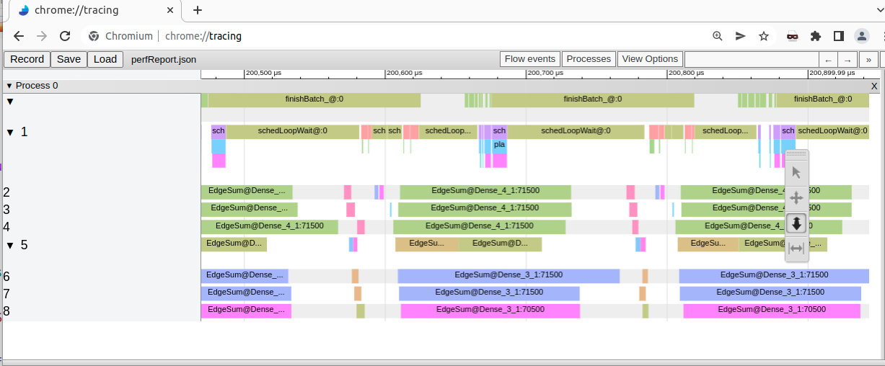

# LLRT

Local Learning Rule Tensors (LLRT) is a neural network library to help you implement new biologically plausible neuron learning rules. LLRT gives you the ability to write custom neuron behavior, then run experiments with different network architectures, without having to rewrite neuron behavior for the different architectures.

The primary design goal of LLRT is ease of experimentation, with good performance and automatic multithreading.


**Features**

 * Write the behavior of each neuron and synapse using arbitrary C++ code, with whatever C++ features you like
 * Connect layers of neurons together independently of neuron behavior, in connectivity patterns such as Dense or Local2D.
 * Pretty fast for something that runs on CPU[^1]
 * Flip a switch to turn on multithreading[^2]

[^1]: Templates give the compiler enough information to inline the inner loop that iterates over the synapses, if it chooses to. This motivated the templated design of LLRT. It means there is no calculation of unused parameters, no dynamic dispatch, and no function call overhead in the inner loop (unless you add these things yourself explicitly, or the compiler chooses not to inline).

[^2]: ... if you first check your code to be sure it's safe to flip that switch. LLRT comes with an automatic task and data parallelism system. In fact, LLRT could be used as a more general purpose multithreading system, as long as you can formulate your task as a large number of small units communicating with each other.


LLRT is not designed for conventional ML projects. It's not a substitute for tensorflow or torch. You may wish to first experiment with neuron learning rules in LLRT, taking advantage of the design separation between network architecture and neuron behavior, before re-implementing your neurons in another framework to take advantage of CUDA.


## Structure of an LLRT Network
Let's take a look at some basic concepts.  These will make it easier to understand what's going on in the examples.

An LLRT Network consists of Components connected by Links.

Each Component represents perhaps millions of neuron bodies, or *nodes*, arranged in a tensor (multi-dimensional array).

A Link consists of perhaps millions of *edges* connecting nodes between two Components.  Information can flow in either direction along a Link, which allows for both forward neuron activation and backwards propagation of learning signals.

For efficiency, the connectivity pattern of a Link does not usually exist as explicit pointers from one node to another.  Instead, the connectivity is given implicitly by an iteration pattern.  Each type of Link has its own iteration pattern, which is a loop that visits pairs of nodes between the two Components and calls a user-supplied function (a *kernel*) on each pair of nodes and the edge between them.

You define a neuron's behavior in LLRT by defining kernels, which are functions that you apply in sequence to the edges incident to the node, and to the node itself.  The kernels do things like sum up incoming voltage or calculate the neuron's activation potential.

The core functionality of LLRT is to allow you to apply a kernel to a Link. The process of doing that is called a "link operation." Applying the kernel to many links can be called a "network operation." One or more network operations - applying one or more kernels to one or more links - may be scheduled for parallel execution as a "batch."

You can also apply a kernel to the nodes in a Component. This is really still applying the kernel to a Link; every Component has a self-link with an edge from each node back to itself. So, looping over the edges of the self-link is effectively looping over the nodes of the Component.


### 0 ends and 1 ends
One end of each Link is the 0 end, and the other end is the 1 end.  This may make a difference for the connectivity pattern.  For example, in a strided local2d link, the 0 end is the bigger end, and the 1 end is the smaller end.  For a local2d link, going from end 0 to end 1 has the connectivity pattern of a convolution, and going from end 1 to end 0 has the connectivity pattern of a transpose convolution.

The ends of a Link are called LinkEnds.

Components store the Links that are incident to them.  A Component's Links are divided into the Links where the Component is attached to end 0, and the Links where the Component is attached to end 1.


### Near ends and far ends
From the perspective of a particular Component, C, there is another way to distinguish edge-ends.  One end of the edge, the end that connects to a node in C, is the "near" end, and the other end, which connects to a node in the other Component, is the "far" end.

A single edge connecting two neurons looks like this:

Near Node ─── Near Edge-End ─── far edge-end ─── far node

Alternatively:

N ─── E ─── e ─── n


These letters NEen are a standard notation in LLRT.  N stands for Node, E stands for Edge-End, a capital letter means "near," and a lowercase letter means "far."  Different data can be stored and updated at each of these four places.  Which node is the "near node" and which is the "far node" depends on which Component we are processing at the moment.

Typically, an operation may read and write to the near node and the near edge-end, but should only read from the far node and the far edge-end. The near-node node can be thought of as responsible for updating its own state and the state of the near edge-ends.  This convention helps avoid race conditions when running operations in parallel. See also the "near-node guarantee" in the Parallelism section.

If you want to send a "message" from the near node to the far node, good policy is to first post the message to the near edge-end.  Once all messages of that kind have been posted for all nodes, you can have the far nodes read the messages in a second network operation.

### Axons and dendrites
Besides 0/1, or near/far, there is a third way to distinguish edge or Link ends.  One end of every Link is an "axon," and the other end is a "dendrite."  These labels are independent of which end is 0 or 1.  By default end 0 is the axon, and end 1 is the dendrite, but it can be configured so that end 0 is the dendrite and end 1 is the axon.

As in biology, it's expected that a neuron will activate based on information from its dendrite edges, and will send out this activation along its axon edges.  Learning signals are expected to propagate in the opposite direction.  However, this is only a convention, and you may define any neuron behavior you like.  You may completely ignore the axon/dendrite designation if you wish.

You might want to take a look at [GLOSSARY.md](GLOSSARY.md), for later reference.


## Diving in
[examples/ex1.cpp](examples/ex1.cpp) is a commented implementation of a Galves–Löcherbach integrate and fire neuron. It can be built and run by:
```
cd build
cmake ..
make ex1
./ex1
```
Reading the source code of this example, armed with the information from the previous sections, will tell you the basics of how LLRT is used.

## Building your project with LLRT
CMakeLists.txt uses CMake to build the tests and examples. You can modify that to build your project. Just use the MakeLLRTProgram function, giving it a name for your project, and the list of source files. Then build it as in the example above.


If you want to build your project with some build system other than CMake, you'll need to use genProcessLink.py script to generate the "process_link.hpp" header, which you'll include in your source files. The basic steps are:

 * Write your code that uses llrt, such as mySourcefile1.cpp and mySourcefile2.hpp.
 * Run a command like:
```
python3 genProcessLink.py -o process_link.hpp mySourceFile1.cpp mySourceFile2.hpp
```

   This will scrape your source files for calls to ProcessLink (and ProcessNetLinks, ProcessNetCmps, etc) and generate the functions you called. The generated file will be named "process_link.hpp".
   
 * Put `#include "process_link.hpp"` (the file you just generated) at the top of your source files.
 * Build your project together with `process_link.hpp`, `include/*.hpp` and `src/*.cpp`. Compile with -pthreads and c++20. For example, with g++, you might use a command like:
 ```
 g++ -O3 -std=c++2a -pthread -Iinclude -I . src/*.cpp mySourceFile1.cpp -o myLLRTProgram
 ```

## More about link operations

This section assumes you've already read [examples/ex1.cpp](examples/ex1.cpp). So you've seen some examples of how to apply a kernel to links in the network.

As mentioned earlier, the core function of LLRT is to allow you to apply a "kernel" to a Link.  A kernel is a functor (an object that implements `operator()`) or a lambda, which takes as parameters values related to data stored on two neurons and the edge connecting them. The kernel will execute for every edge in the link.

To apply a kernel to a link, you call a function named something similar to `ProcessLink_NEn`. The "`_NEn`" is the "kernel parameter specifier," in this case naming the three parameters `N`, `E`, and `n`. We've seen these before: they are the near node `N`, the near edge-end `E`, and the far-node `n`. So, `ProcessLink_NEn` would take a kernel with three parameters: `N`, `E`, and `n`. The type of these parameters depends on the type of data stored on the nodes and the edge-ends.

It might be called like this:
```C++
ProcessLink_NEn(l, 0, [_1, _0](IFNeuron &N, const IFDendrite &E, const IFNeuron &n){
    N.v[_1] += E.w * n.x[_0];
}, Parallel);
```

The first parameter is a single `Link<TL>`. The second parameter is which end of the link you want the operation to run on, end 0 or end 1. The third parameter is the kernel, whose parameters must match the kernel parameter specifier, "`_NEn`". And the fourth parameter, which is optional, describes options for the operation, in this case that the operation should run in parallel on multiple worker threads.

It will usually be more convenient to operate on many links at once. LLRT has a number of similar functions for this purpose. They all have a kernel parameter specifier in their names, represented below by `*`. As a result they must be generated by genProcessLink.py before being used.

`ProcessLink_*` operates on one link-end, taking parameters (link, whichEnd, kernel, JobOptions).

`ProcessLinks_*` operates on a set of link-ends, taking parameters (`std::vector<LinkEnd<TL> *>` linkEnds, kernel, JobOptions)

`ProcessCmp_*` operates on the nodes of a single component, taking parameters (component, kernel, JobOptions).

`ProcessCmpLinks_*` operates on the links incident to a single component, taking parameters (component, kernel, JobOptions).

`ProcessNetLinks_*` operates on all link-ends in the network, taking parameters (network, kernel, JobOptions).

`ProcessNetCmps_*` operates on all components in the network, taking parameters (network, kernel, JobOptions).

The set of kernel parameter specifiers is listed at the top of the generated `process_link.hpp`. Repeating them here:

```
N = near node
Ni = index at near component
E = near edge-end
Ei = index at near link end
n = far node
ni = index at far component
e = far edge-end
ei = index at far link end
f = edgeInfo
r = ThreadsafeRNG
```
The "index at" specifiers give you the index into the data array. The index is a `size_t`. For example, if `data` is the vector of data on the component, then `data[Ni] = N`. `Ni` is useful if you want to copy inputs from outside the network to the input component, or read off outputs from the output component.

`f` gives you `edgeInfo`, which is a `size_t` that tells you, among the edges of the near node within a particular link, which edge it is.  For example, in a `Local2DLink` with depth 1 and radius 1, this would tell you whether the edge is northwest, north, northeast, west, center, east, southwest, south, or southeast. It's primarily useful if you have a locally connected link and want to apply a convolution to it; you need to know the direction of each edge in order to know which element of the convolution should be used.

`r` gives you a `ThreadsafeRNG`. You can use it as a generator to pass to a distribution. For example:

```C++
    ProcessNetLinks_Er(net, [](IFDendrite &E, ThreadsafeRNG &r){
        E.w = std::normal_distribution<float>(0,1.0)(r);
    }, Dendrites | Parallel)
```

What makes `r` "threadsafe" is that it can copy itself for each worker thread, in such a way that the copies generate different pseudo-random sequences.

The last option to these Process commands is the JobOptions. The set of JobOptions is as follows. Multiple options may be joined together with `|`.

`Axons` means that the job only executes on link-ends that are axons.

`Dendrites` means that the job only executes on link-ends that are dendrites.

`KernelName("My Kernel Name")` allows you to give a human-friendly name to the kernel, which will show up on the performance report.

`NearCmpFilter(filter)` takes a function argument, `filter`, to only iterate over links where the near cmp matches the filter. `filter` takes a `Component<TL> &` and returns true if the kernel should execute on that near component, and false otherwise. Only applicable for `ProcessNetCmps` or `ProcessNetLinks` operations.

`FarCmpFilter(filter)` is similar to `NearCmpFilter`, but for the far component.

`NearCmpName(name)` only executes on the near component if it has exactly the given name. The names of components can be read from the `net.display()` summary. You can also set cmp.name (for a `Component<TL> cmp`) to something more human-friendly if you like.

`FarCmpName(name)` is similar to `NearCmpName`, but for the near component.

`Parallel` means that the operation may be broken up into multiple chunks that the worker threads are allowed to execute at once and in any order.

`ParallelNonBlocking` is like `Parallel`, except the operation does not block and will run in the background. Consecutive `ParallelNonBlocking` batches will be done one after the other, in sequence.

`ParallelPart` adds the operation to the current batch, but does not submit it for processing yet. A set of `ParallelPart` operations should be followed by a `Parallel` or `ParallelNonBlocking` operation to submit the whole batch to the scheduler and run it.

`Combiner(myCombiner)` specifies a function that combines the results of execution of the different worker threads, allowing you to collect summary statistics about the network in parallel. More on that later.

## Additional link types
[examples/ex2_linktypes.cpp](examples/ex2_linktypes.cpp) demonstrates how to use a few more link types, other than DenseLink. It covers:
 * SameLink, which links each node on one component with the node on another component that has the same index. The self-link that links each node on a component back to itself, allowing you to iterate over the nodes on the component, is a SameLink.
 * AdjListLink, which links each node with other nodes according to an adjacency list that you configure.
 * Local2DLink, which links each node with other nodes in the connectivity pattern of a 2D convolution

## Parallelism
Internally, each Network has a Scheduler which manages a pool of worker threads.  You specify the number of worker threads when constructing the Network.

First, if you pass 0 to your Network when you create it, or don't pass an argument for the number of worker threads, then the Network will run sequentially without using any extra threads.  If you don't need multithreaded performance, that's the easiest thing to do. It will even be a bit faster on one core (compared to multithreading with 1 worker thread) because the overhead is lower. It's also useful for debugging because the call stack for your operation will be in the same thread where you started the operation.

If you specify a nonzero number of worker threads, the Scheduler will spawn that many workers. In addition, the Scheduler has its own thread for coordinating the workers, and your main() is another thread. It is suggested that you use a number of workers equal to the number of cores minus 1.

Even after initializing some worker threads, your operations will be single-threaded unless you use the appropriate JobOption. The simplest parallel JobOption to use on your operation is the `Parallel` option. From the example:

```C++
    ProcessNetLinks_NEn(net, [_1, _0](IFNeuron &N, const IFDendrite &E, const IFNeuron &n){
        N.v[_1] += E.w * n.x[_0];
    }, Dendrites | Parallel);
```

First, a word on thread safety. The way LLRT works, it's as if each near-node `N` has its own thread, and kernels are applied to each edge incident to `N` in sequence. That's not actually true, but it's a good way to think about it. The above operation is safe because the kernel applications that increase `N.v[_1]` will be applied in sequence.

In general, we want to read and write to the near node, and only read from the far node. More on thread safety in the "near-node guarantee" section.

Like any operation, the above `Parallel` operation collects a set of Links on which to run the operation. It then submits the Link operations to the Scheduler together, as a batch.

The Scheduler assigns the batch to the worker threads, attempting to divide the total work evenly between them. Individual Link operations have the ability to split themselves up into parts of specified sizes. This helps in evenly distributing the work.

A single Link operation can be spread across many workers, if necessary, providing data parallelism. And a batch may consist of many Link operations, providing task parallelism.


### Thread safety with the Near-Node Guarantee
Parallelism in LLRT is done with a minimum of locks, for efficiency.  Instead, you must ensure that you aren't accessing or changing values in a way that could cause a race condition. To assist with this, LLRT provides the near-node guarantee.

The near-node guarantee says: **when a worker thread runs a kernel on an edge with a particular near node, no other worker thread will run a kernel with that same near node at the same time**.

So, if your operation is:

```C++
    ProcessNetLinks_NEn(net, [_1, _0](IFNeuron &N, const IFDendrite &E, const IFNeuron &n){
        N.v[_1] += E.w * n.x[_0];
    }, Dendrites | Parallel);
```
You can see how it makes use of the near-node guarantee. If we didn't have that guarantee, then multiple threads might be adding to `N.v[_1]` at the same time! That would be a race condition resulting in garbage data in `N.v[_1]`. Fortunately, we do have the near-node guarantee, so no two threads will access `N.v[_1]` at once, and the above operation will add up the values at `N` one-by-one in sequence.

You can imagine it's as if each near-node had its own dedicated thread, applying kernels to the edges of that near-node in sequence. That's not actually happening, but from a thread-safety perspective it's very similar.

Imagine we had instead done this:
```C++
    ProcessNetLinks_NEn(net, [_1, _0](IFNeuron &N, const IFDendrite &E, const IFNeuron &n){
        n.v[_1] += e.w * N.x[_0]; // Don't do this!
    }, Axons | Parallel);
```
If this were single-threaded, it would do the same thing as the previous operation. But it is Parallel, and so it is possible that more than one thread could be trying to alter `n.v[_1]` at the same time. There is no "far-node guarantee."

If you feel like you want to update the far node, perhaps you can instead flip your operation so it runs on the other component, where the far node becomes the near node. If you feel like you want to update both the far node and the near node at the same time, you'll most likely need to split it into two consecutive operations. One operation would "post" a message to the edge and update the node at that end, and the other operation reads the message from the other end of the edge and updates the other node.

We also have to avoid reading values on the far-node at a time when they might be changing. Consider this incorrect operation:

```C++
    ProcessNetLinks_NEn(net, [](Node &N, Edge &E, Node &n){
        N.v[_1] += E.w * n.v[_1]; // unsafe; reading n.v[_1] when it may be changing
  }, Dendrites | Parallel);
```
It is possible that n.value could be updating at the same time we are trying to read from it. That's because `n.value` from the perspective of the current edge-end, is also "`N.value`" from the perspective of the other end of the edge.


### Pipelining batches with ParallelNonBlocking

The `Parallel` option is easy to use, but involves certain delays. Your main() thread must issue the call, and the Scheduler thread must assign the jobs to the workers and notify them. It would be faster for the workers to already have the next batch of operations queued up, so that the moment they finish the current batch they can start on the next batch.

In order to improve performance this way, you can use the `ParallelNonBlocking` option. Here's an example of how that looks:
```C++
    ProcessNetLinks_NEn(net, [_1, _0](IFNeuron &N, const IFDendrite &E, const IFNeuron &n){
        N.v[_1] += E.w * n.x[_0];
    }, Dendrites | ParallelNonBlocking | KernelName("EdgeSum"));
```
This example is taken from [examples/ex3_nonblocking.cpp](examples/ex3_nonblocking.cpp) which you may want to look at. The operation does not block and will run in the background. Consecutive `ParallelNonBlocking` batches will be queued up and done one after the other, in sequence, while each batch individually runs in parallel.

Sometimes you will need to wait for the queued up batches to finish. One easy way to do that is to call `net.finishBatches()` where `net` is your `Network<TL>` object. This will block until all pending batches are finished.

It is also possible to wait for one specific batch to finish. This is demonstrated in [examples/ex3_nonblocking.cpp](examples/ex3_nonblocking.cpp). The Process family of functions have a return value, which is the batch number, a `size_t`. If you save that batch number, you can wait for the batch to finish with `net.finishBatch(batchNum)`. The example has a batch that applies inputs, from an `std::vector`, to a component in the network. This batch needs to be finished before we can fill the input vector with new values, otherwise there would be a race condition. So, we call `net.finishBatch(inputBatch)` before filling the input vector with new values. Other non-input batches can still run in the background while we do this, so the worker threads are not interrupted.

### ParallelPart
It is best to have one large batch rather than several small ones. Even when pipelining multiple batches with `ParallelNonBlocking`, there is some delay involved when workers wake up to start on each batch, and then notify each other when the batch is done so they can move on to the next. So, if you have several operations that are capable of running at once, it is recommended you put them all in the same batch. This is done with the `ParallelPart` JobOption. Several operations with the `ParallelPart` option should be followed by an operation with the `Parallel` or `ParallelNonBlocking` option. This last operation will submit all the parts to the Scheduler in a single batch so work can begin.

You might do this, for example, if your network has several types of neurons and all the different types can calculate their activation values at the same time. All but one of the types of neurons would be represented by an operation using the `ParallelPart` option, and the last type of neuron would have an operation using the `Parallel` or `ParallelNonBlocking` option.

### Collecting summary data from the network
The techniques of this section are demonstrated in [examples/ex4_combiners.cpp](examples/ex4_combiners.cpp) .

An easy way to collect summary data is to use a kernel that adds up values into a variable to which it holds a reference. For example:
```C++
    //finish batches first, because we're about to run a
    //single-threaded operation and we don't want the
    //Scheduler running parallel operations at the same time.
    net.finishBatches();
    float totalActivations=0;
    ProcessNetCmps_N(net, [&totalActivations](const IFNeuron &N){
        totalActivations += N.x[1];
    });
    std::cout << totalActivations << std::endl;
```
This kernel correctly adds up all the activations from nodes in the network. However, it can only run single-threaded. Obviously we do not want multiple threads trying to write to the totalActivations variable at the same time!

For large enough networks, and frequent enough collection of summary data, it can make sense to collect summary data in parallel. To do this we need a kernel that maintains a running sum as its own member variable. The important thing to know is that your kernel gets copied for each job chunk, and then each copy collects summary data, and then you need to combine the copies. At the end of it, your original kernel will contain the collected summary. Here's how you do it:
```
// sum up node potentials in a parallel way
// When we run the operation, this kernel will be copied
// into each worker thread, and each copy will get the sum
// from just the nodes assigned to that worker thread
struct PotentialSumKernel_N{
    float totalPotential=0;
    void operator()(const IFNeuron &N){
        totalPotential += N.v[1];
    }
} PSK_N;

// The "Combiner" will add up the results from all the
// copies of PSK_N, putting them in the original PSK_N
auto PSK_Combiner = [](PotentialSumKernel_N &psk_original, PotentialSumKernel_N &psk_copy){
    psk1.totalPotential += psk2.totalPotential;
};

ProcessNetCmps_N(net, PSK_N, Parallel | Combiner(PSK_Combiner) | KernelName("Combiner"));
std::cout << "Total potential: " << PSK_N.totalPotential << std::endl;
```
This code example can be found in [examples/ex4_combiners.cpp](examples/ex4_combiners.cpp)

If you're doing this, make sure that your original kernel is still in scope when it's time to combine the copies back into it. Otherwise you'll get a segfault! So, be careful with ParallelNonBlocking operations when you are using Combiners.


### Random number generation

On the subject of kernel copies, note that a random number generator is an external variable that is written to with every random number it generates.  That's why you should use the "`g`" parameter to get a `ThreadsafeRNG`, instead of using your own, if you want to run your operations in parallel.  The `ThreadsafeRNG` makes a new copy of itself with a different seed in each worker thread so there is no conflict.

Internally, the `ThreadsafeRNG` wraps a `std::mt19937_64`. It is possible to write your own threadsafe RNG, as a member variable of your kernel struct. It will get copied when your kernel does, and will need to give each copy a new seed. If you want to do this, look at [include/network.hpp](include/network.hpp) where the ThreadsafeRNG is defined.

### Determinism
A word on determinism.  It's a desirable property that when you give the network a particular initial random seed, the resulting behavior is absolutely determined by that seed.  This form of determinism makes experiments completely repeatable.

There are two sources of nondeterminism in the calculations done by LLRT. There is nondeterminism caused by the initial seed of the RNG, and there is nondeterminism resulting from adaptive scheduling. Both of these can be eliminated using:

```C++
net.seed(137); // seed the ThreadsafeRNG with some fixed value
net.setDeterminism(); // disable adaptive scheduling
```

That's all it takes for your LLRT program to be completely deterministic, generating exactly the same results every time. Unless, of course, you introduce some other external source of nondeterminism.

So what is adaptive scheduling? With adaptive scheduling (the default), the scheduler keeps track of how long each operation takes. This allows it to divide operations more evenly between the different workers. Because the observed time to complete each operation depends on your CPU, this will result in the sizes of job chunks varying somewhat between runs of your program.

Remember that the ThreadsafeRNG needs to be copied for each job chunk, creating a new seed which it uses for that chunk. So, if the sizes of job chunks vary, the random sequences resulting from the ThreadsafeRNG will vary as well. That's the main reason adaptive scheduling is nondeterministic.

Varying job chunk sizes can also result in a small amount of nondeterminism for Combiner operations because floating-point arithmetic is not perfectly associative. With floating point numbers, (a+b+c+d)+(e+f+g) might be very slightly different from (a+b+c)+(d+e+f+g). This won't have any effect on most operations, but Combiner operations typically calculate a floating point sum of the sum of each job chunk.

When adaptive scheduling is turned off, the scheduler will assume each kernel execution on a single edge takes the same amount of time as any other kernel execution. This results in the scheduler dividing each batch into job chunks in exactly the same way every time.

This could result in an uneven division of work between the worker threads, if you submit a batch that has multiple types of kernel in it. Any performance loss from that is likely to be pretty small, though. If you are sure it's a problem, you could always just split it into two batches, so that each batch only has one type of kernel.


### Testing multithreaded safety
After you've enabled multithreading, you should test it to ensure it's actually safe.  Use tools such as valgrind, asan, tsan, or thread sanitizer.


## Profiling

LLRT comes with a profiler that records when worker threads started and finished each job chunk, and some of what the main thread and scheduler thread are doing too. It is disabled by default because it impacts performance somewhat, and more importantly it generates a lot of data very quickly. On my computer, the [ex3_nonblocking.cpp](ex3_nonblocking.cpp) example generates 30mb of performance data from half a second of operations. So it is recommended to use the profiler only on relatively short runs.

To turn on the profiler, you need to compile LLRT with the PROFILER preprocessor macro. You can tell cmake to use this macro by saying:

```
cd build
cmake .. -DPROFILER=1
make ex3_nonblocking
```

(You can use -DPROFILER=0 to turn it off again).

Once compiling with the PROFILER flag, at the end of your program, you write `net.perfReport('perfReport.json')`. This will dump performance data to perfReport.json. To view this data, open Chrome and navigate to chrome://tracing, then click load to view the file. You can zoom in and out and click on things for more detail. Each thread has a track, and things done by that thread show up as horizontal bars on the track.

Here's a perf report for [ex3_nonblocking.cpp](ex3_nonblocking.cpp).

 

It is recommended that you use the KernelName("SomeName") JobOption to make this display more readable.  For example, one of the green bars in the middle of the above image says "`EdgeSum@Dense_4_1:71500`." This means that the kernel named "EdgeSum" ran  on the link-end named "Dense\_4\_1." Dense\_4 refers to a Dense link that is the fourth link created in the network (including the component self-links). "Dense\_4\_1" means that it is end 1, as opposed to end 0, of that link. 71500 is the amount of "progress" that was assigned to this job chunk, which corresponds to the number of edges for the job chunk. There are two other green bars in the middle that say the same thing, which means the `EdgeSum@Dense_4_1` link operation was divided into three chunks of 71500 edges each that ran on three different workers. Actually, there's a fourth part of that operation that's half the size, on the fourth worker.

The little pink and blue bars to the right of it are much smaller job chunks. In this case, those are activate, potential, and input operations running on the nodes. White space between the job chunks is mostly idle time. In this case the idle time is mostly due to variations in worker thread timing and notification delays. It's not too bad; the scale at the top reads in microseconds. If the network were larger, there would be a smaller proportion of idle time, because the job chunks would take more time.

The top track is the main() thread. Most of the time is occupied waiting in finishBatch. The little green bars are when the main thread submits network operations, which you can see are followed by a lot of Scheduler activity in the second track. The blank spaces in the top thread are untracked activity in main(), in this case filling the input array with random data.
